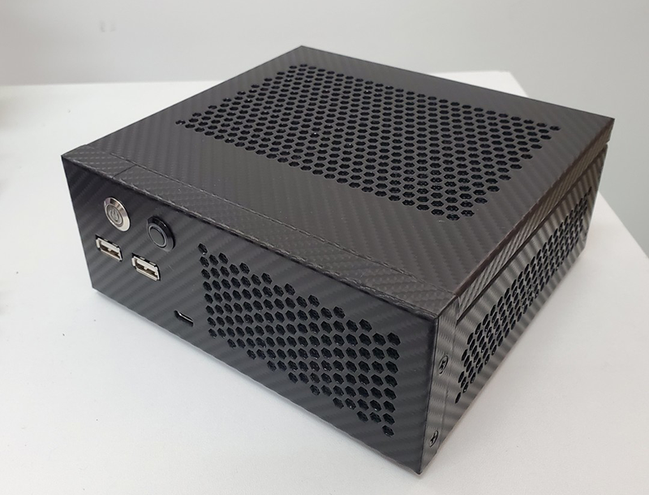

## 云轩H170 STX 技嘉 H170MSTX-DATTO-O3 黑苹果 OpenCore EFI



### OpenCore

[OpenCore 1.0.4](https://github.com/acidanthera/OpenCorePkg)

### macOS

- macOS Big Sur
- macOS Monterey
- macOS Venture
- macOS Sonoma
- macOS Sequoia **(WiFi 必须使用 [OCLP-Mod by laobamac](https://github.com/hackintosh-club/intel-nuc10/releases/tag/oclp) 补丁)**

### 硬件

- 芯片组: H110
- BIOS版本: F21 by [SMX Diy论坛](http://www.smxdiy.com/)  @dsanke
- 处理器: 英特尔8代 i7-8700 ES (QN8H)
- 内   存: 协德 8GB*2 DDR4 2666Mhz
- 硬   盘: 十铨 M.2 2280 SATA SSD 512G MacOS
- 硬   盘: 东芝 TR200 SATA SSD 240G Windows
- 核   显: 英特尔超核心显卡630（DP & HDMI output）
- 声   卡: 瑞昱 ALC255
- 有线网卡:  英特尔有线网卡
- 无线网卡: 白果拆机94360CS2 + 转接

### BIOS设置

```
BIOS
     |-- Fast Boot：Disabled
     |-- Windows 8/10 Fetures：Other OS
     |-- Storage Boot Option Control：UEFI
     |-- Other PCI devices：UEFI

Peripherals
	   |-- USB Configuration
	      |-- Leacy USB Support：Enabled
	      |-- XHCI Hand-off：Enabled
	   |-- SATA And RST Configuration
	      |-- SATA Mode Selection：AHCI
Chipset		
     |-- VT-d：Enabled
     |-- Internal Graphics：Enabled
     |-- DVMT Pre-Allocated：64M
     |-- DVMT Total Gfx Mem：MAX
     |-- IOAPIC 24-2119 Entries：Disabled
```

### 注意事项

 - 安装成功后必须使用  [OCAuxiliaryTools](https://github.com/ic005k/OCAuxiliaryTools) 生成你自己的 SMBIOS
 - [张大妈 --- 云轩h170 hackintosh](https://post.smzdm.com/p/ag827k43/)
 - [张大妈 --- 云轩h170装机体验](https://post.smzdm.com/p/alpool7p/)
 - 说明：2020年9月16日我的云轩已经售出，当时最后的版本为OpenCore 0.6.0
 - 目前的引导为OpenCore 1.0.4 版本，如需帮助请和我联系


### 联系我们

QQ群: 23304408


### 常用工具

- [Hackintool](https://github.com/headkaze/Hackintool) 
- [OCAuxiliaryTools](https://github.com/ic005k/OCAuxiliaryTools) AKA `OCAT`.
- [OpenCore Configurator](https://mackie100projects.altervista.org/opencore-configurator/) AKA `OCC`.
- [gibMacOS](https://github.com/corpnewt/gibMacOS) Build your own MacOS image.
- [ProperTree](https://github.com/corpnewt/ProperTree) Plist editor.
